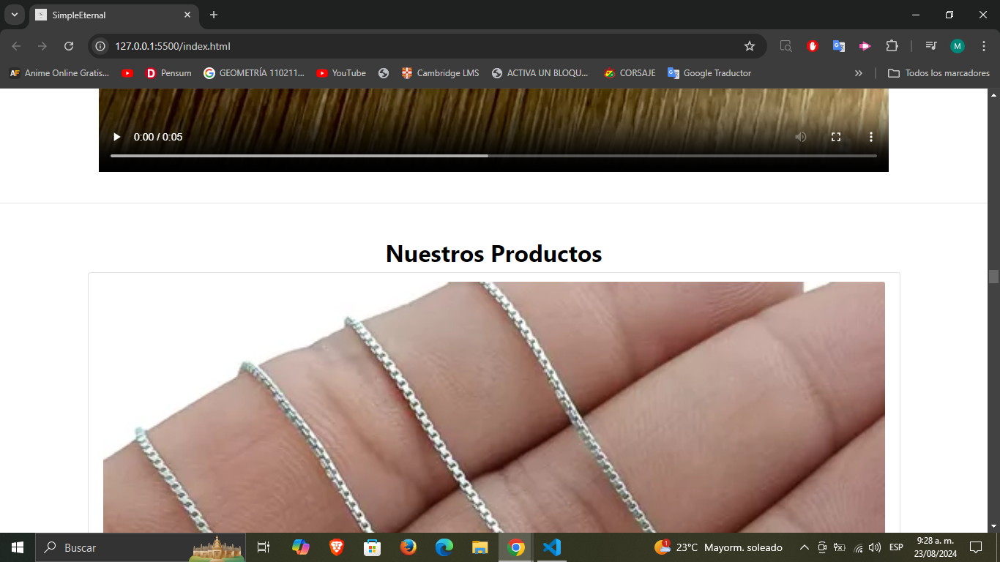
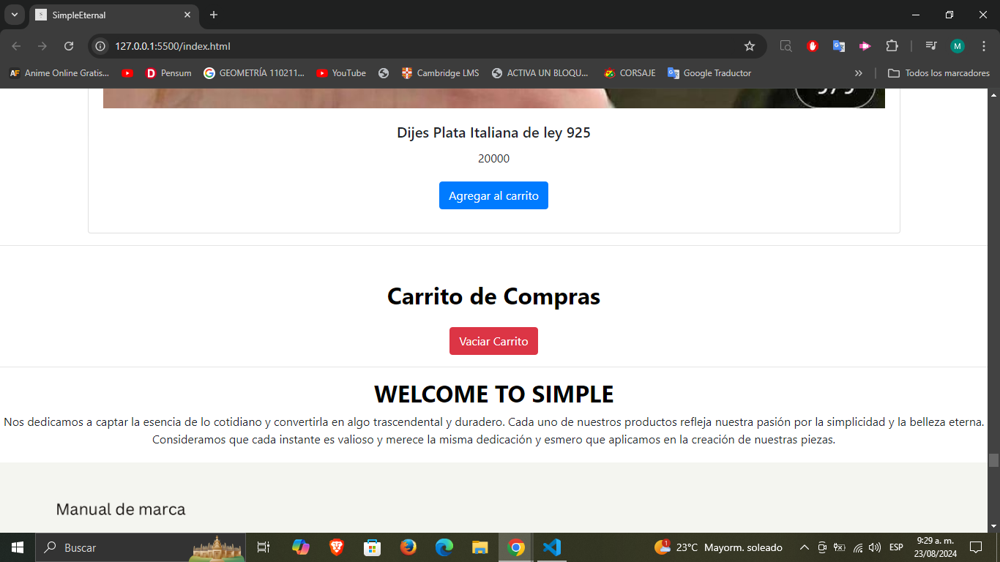
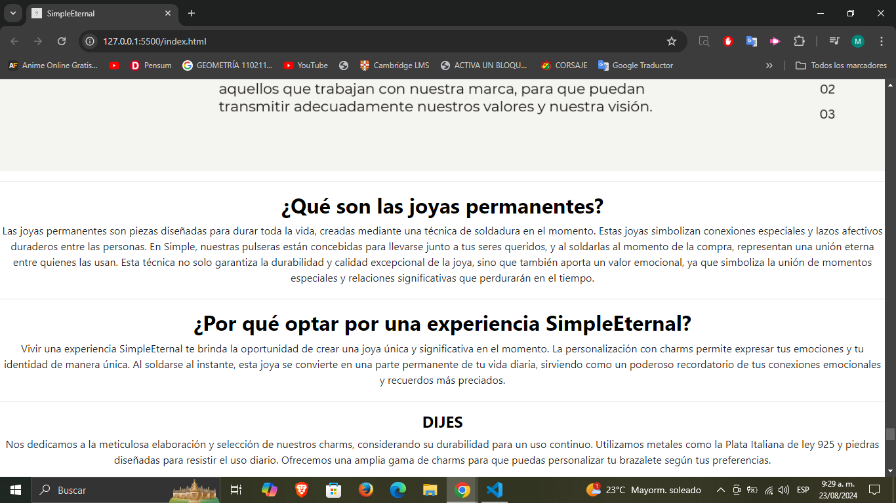
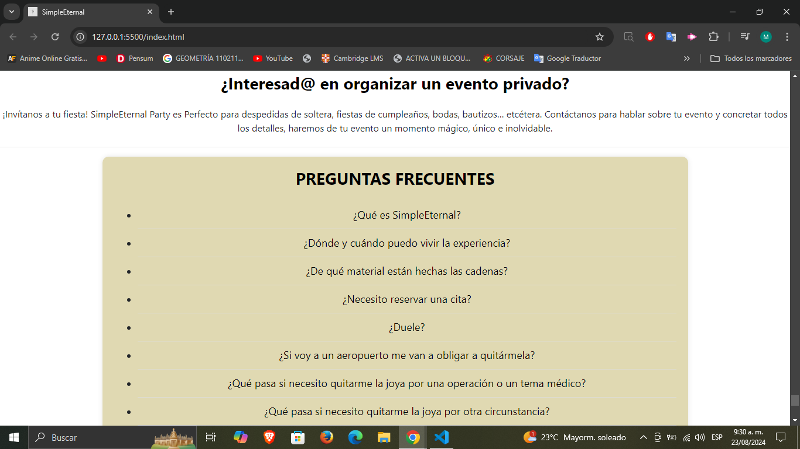
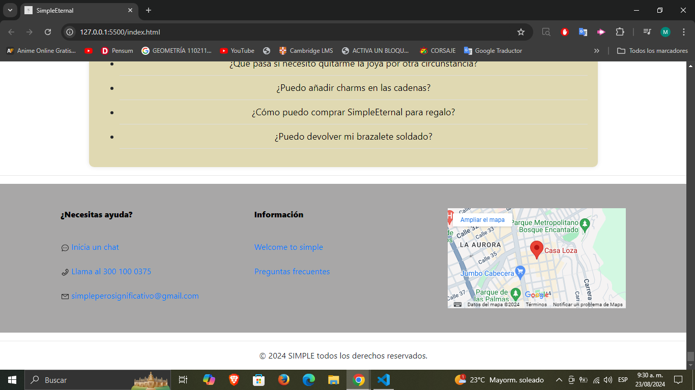

# Proyecto en HTML y CSS: Simple Eternal

En el siguiente repositorio se realizara ub cambio de imagen a Simple Eternal una pagina web ya pre-establecida en donde se busca mantener su esencia de lo simple a lo eterno, pero con un enfoque mas profesional y minimalista.

## Tabla de contenidos
En este proyecto esta divido:
1. Encabezado
2. Header
3. Main

  3.1. Comercial
  
  3.2. Carrito

  3.3. Sobre Nosotros

  3.4. Informacion Relevante

  3.5. Preguntas Frecuentes

4. Footer

  4.1. Pie de Pagina

  4.2. Derechos de Autor

## Instalaciones 

1. Para poder tener el codigo primero debes decargar el ZIP que se encuentra en "<>CODE".

2. Despues de descargarlo, seguidamente debes extraerlo.

3. Ya cuanto se halla extraido, la carpeta la puede abrir en el Visual Studio Code.

## Todos los productos

A continuacion se mostrara el como se construyo la siguiente pagina:

Encabezado y Header:

Main(Comercial):Primera Parte:

Main(Carrito):

Main(Sobre Nosotros):

Main(Informacion Relevante):

Main(Sobre Preguntas Frecuentes):

Footer(Pie de Pagina y Derechos de Autor):

Hecho por @MichelAdrianToradoRoa

